# Assignment 5

(using oracle live sql)

**Consider the following Employee table and execute the queries based on it:**

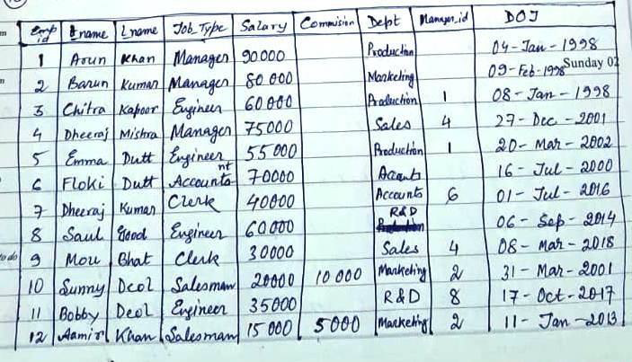

```
CREATE TABLE employee(emp_id number, f_name varchar2(10), l_name varchar2(10), job_type varchar2(10), salary number(10), dept varchar2(10), commission number(10), manager_id number, DOJ DATE);
INSERT INTO employee VALUES(1, 'Arun', 'Khan', 'Manager', 90000, 'Production', NULL, NULL, to_date('04-01-1998', 'dd-mm-yyyy'));
INSERT INTO employee VALUES(2, 'Barun', 'Kumar', 'Manager', 80000, 'Marketing', NULL, NULL, to_date('09-02-1998', 'dd-mm-yyyy'));
INSERT INTO employee VALUES(3, 'Chitra', 'Kapoor', 'Engineer', 60000, 'Production', NULL, 1, to_date('08-01-1998', 'dd-mm-yyyy'));
INSERT INTO employee VALUES(4, 'Dheeraj', 'Mishra', 'Manager', 75000, 'Sales', NULL, 4, to_date('27-12-2001', 'dd-mm-yyyy'));
INSERT INTO employee VALUES(5, 'Emma', 'Dutt', 'Engineer', 55000, 'Production', NULL, 1, to_date('20-03-2002', 'dd-mm-yyyy'));
INSERT INTO employee VALUES(6, 'Floki', 'Dutt', 'Accountant', 70000, 'Accounts', NULL, NULL, to_date('16-07-2000', 'dd-mm-yyyy'));
INSERT INTO employee VALUES(7, 'Dheeraj', 'Kumar', 'Clerk', 40000, 'Accounts', NULL, 6, to_date('01-07-2016', 'dd-mm-yyyy'));
INSERT INTO employee VALUES(8, 'Saul', 'Sood', 'Engineer', 60000, 'R&D', NULL, NULL, to_date('06-09-2014', 'dd-mm-yyyy'));
INSERT INTO employee VALUES(9, 'Mou', 'Bhat', 'Clerk', 30000, 'Sales', NULL, 4, to_date('08-03-2018', 'dd-mm-yyyy'));
INSERT INTO employee VALUES(10, 'Sunny', 'Deol', 'Salesman', 20000, 'Marketing', 10000, 2, to_date('31-03-2001', 'dd-mm-yyyy'));
INSERT INTO employee VALUES(11, 'Bobby', 'Deol', 'Engineer', 35000, 'R&D', NULL, 8, to_date('17-10-2017', 'dd-mm-yyyy'));
INSERT INTO employee VALUES(12, 'Aamir', 'Khan', 'Salesman', 15000, 'Marketing', 5000, 2, to_date('11-01-2013', 'dd-mm-yyyy'));
```

**Also consider the following Department table:**

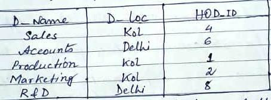

```
CREATE TABLE department(d_name varchar2(10), d_loc varchar2(10), hod_id number);
INSERT INTO department VALUES('Sales', 'Kol', 4);
INSERT INTO department VALUES('Accounts', 'Delhi', 6);
INSERT INTO department VALUES('Production', 'Kol', 1);
INSERT INTO department VALUES('Marketing', 'Kol', 2);
INSERT INTO department VALUES('R&D', 'Delhi', 8);
```

1. **Find the Cartesian product between Employee and Department table.**

   ```
   SELECT * FROM employee e CROSS JOIN department d WHERE e.manager_id=d.hod_id;
   ```
   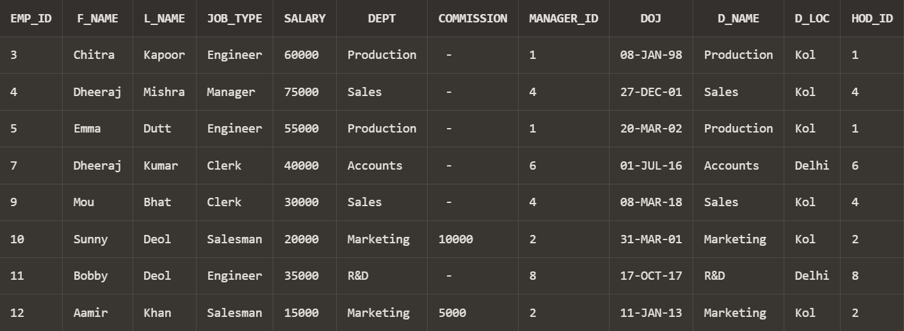
2. **Show the employee names and the respective department location.**

   ```
   SELECT e.f_name, e.l_name, d.d_loc FROM employee e CROSS JOIN department d WHERE e.manager_id=d.hod_id;
   ```
   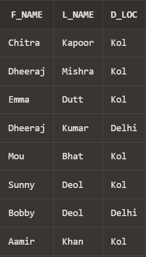
3. **Find the employee name and date of joining who are working in Delhi.**

   ```
   SELECT e.f_name, e.l_name, e.DOJ FROM employee e CROSS JOIN department d WHERE e.manager_id=d.hod_id and d.d_loc='Delhi';
   ```
   
4. Create a table ‘Emp_Address’ for storing the permanent address of the employees and insert the following values:
   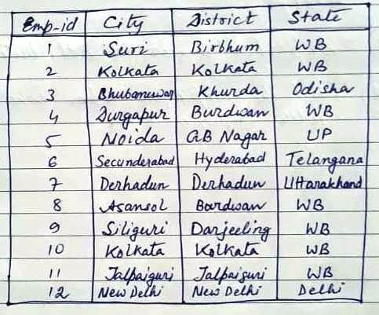

   ```
   CREATE TABLE Emp_Address(emp_id number, city varchar2(20), district varchar2(20), state varchar2(20));
   INSERT INTO Emp_Address VALUES(1, 'Suri', 'Birbhum', 'WB');
   INSERT INTO Emp_Address VALUES(2, 'Kolkata', 'Kolkata', 'WB');
   INSERT INTO Emp_Address VALUES(3, 'Bhubaneswar', 'Khurda', 'Odisha');
   INSERT INTO Emp_Address VALUES(4, 'Durgapur', 'Burdwan', 'WB');
   INSERT INTO Emp_Address VALUES(5, 'Noida', 'GB Nagar', 'UP');
   INSERT INTO Emp_Address VALUES(6, 'Secunderabad', 'Hyderabad', 'Telangana');
   INSERT INTO Emp_Address VALUES(7, 'Derhadun', 'Derhadun', 'Uttarakhand');
   INSERT INTO Emp_Address VALUES(8, 'Asansol', 'Burdwan', 'WB');
   INSERT INTO Emp_Address VALUES(9, 'Siliguri', 'Darjeeling', 'WB');
   INSERT INTO Emp_Address VALUES(10, 'Kolkata', 'Kolkata', 'WB');
   INSERT INTO Emp_Address VALUES(11, 'Jalpaiguri', 'Jalpaiguri', 'WB');
   INSERT INTO Emp_Address VALUES(12, 'New Delhi', 'New Delhi', 'Delhi')
   ```
   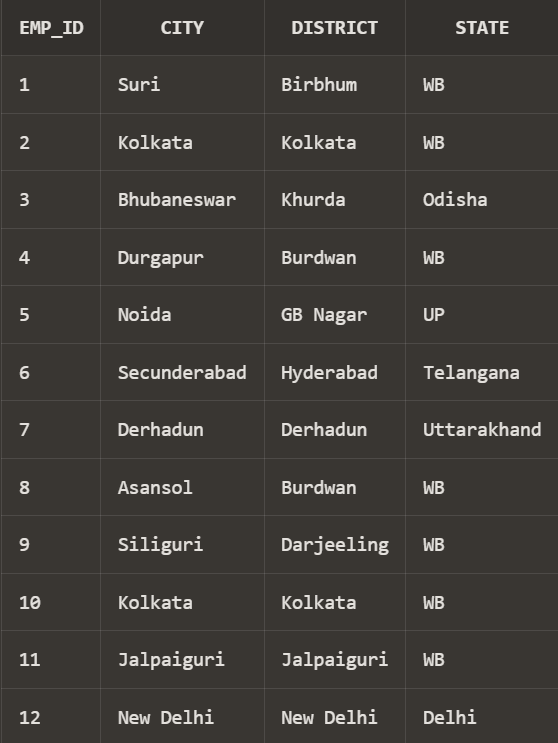
5. **Display the name of employees, department location and the city name the employee belongs to, from the Employee, Department and Emp_Address tables.**

   ```
   SELECT e.f_name, e.l_name, d.d_loc, a.city FROM employee e CROSS JOIN department d CROSS JOIN Emp_Address a WHERE e.emp_id=a.emp_id and e.manager_id=d.hod_id;
   ```
   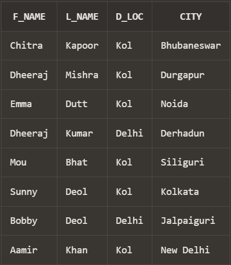
6. **Find the name of each department’s manager.**

   ```
   SELECT f_name, l_name, dept FROM employee WHERE job_type='Manager';
   ```
   
7. **Create ‘Job_Grades’ table and insert the following values:**

   

   ```
   CREATE TABLE Job_Grades(grade varchar2(1), lowest_sal number(10), highest_sal number(10));
   INSERT INTO Job_Grades VALUES('A', 10000, 24999);
   INSERT INTO Job_Grades VALUES('B', 25000, 49999);
   INSERT INTO Job_Grades VALUES('C', 50000, 100000);
   ```
   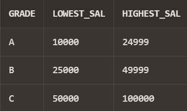
8. **Display the employee names with their respective job grades and salary.**

   ```
   ALTER TABLE employee ADD grades varchar2(1);
   UPDATE employee SET grades = 'A' WHERE salary>=10000 and salary<=24999;
   UPDATE employee SET grades = 'B' WHERE salary>=25000 and salary<=49999;
   UPDATE employee SET grades = 'C' WHERE salary>=50000 and salary<=100000;
   SELECT f_name, l_name, salary, grades FROM employee;
   ```
   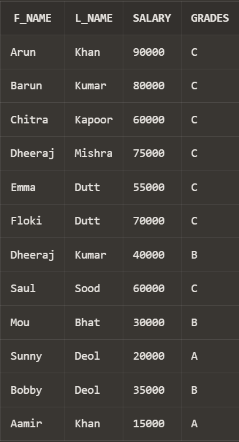
9. **Insert two rows in Employee table having ‘NULL’ values in dept field.**

   ```
   INSERT INTO employee VALUES(13, 'Varun', 'Verma', 'Engineer', 65000, NULL, NULL, NULL, to_date('27-11-2007', 'dd-mm-yyyy'), 'C');
   INSERT INTO employee VALUES(14, 'Ishika', 'Dutta', 'Engineer', 75000, NULL, NULL, NULL, to_date('31-08-2003', 'dd-mm-yyyy'), 'C');
   SELECT * FROM employee WHERE emp_id>12;
   ```
   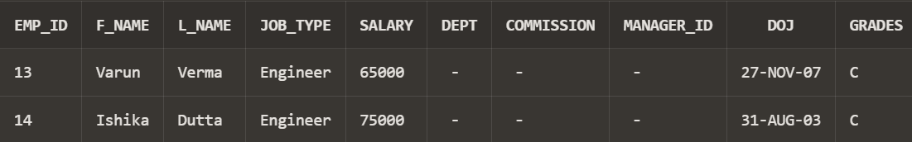
10. **Insert two rows in Department table.**

    ```
    INSERT INTO department VALUES('Finance', 'Kol', 3);
    INSERT INTO department VALUES('Admin', 'Delhi', 5);
    SELECT * FROM department;
    ```
    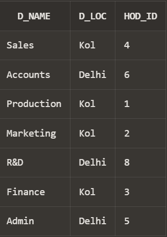
11. **Perform the following joins considering Employee and Department tables.
    a. Natural join
    b. Inner join
    c. Left outer join
    d. Right outer join
    e. Full outer join**
    (b)

    ```
    SELECT * FROM employee e INNER JOIN department d ON e.manager_id=d.hod_id;
    ```
    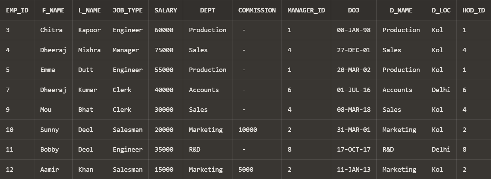
    (c)

    ```
    SELECT * FROM employee e LEFT OUTER JOIN department d ON e.manager_id=d.hod_id;
    ```
    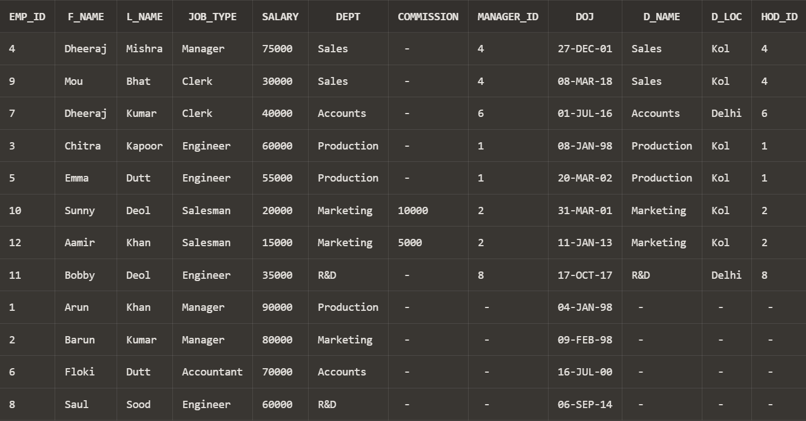
    (d)

    ```
    SELECT * FROM employee e RIGHT OUTER JOIN department d ON e.manager_id=d.hod_id;
    ```
    
    (e)

    ```
    SELECT * FROM employee e FULL OUTER JOIN department d ON e.manager_id=d.hod_id;
    ```
    
