# Assignment 6

(using mysql in xampp)

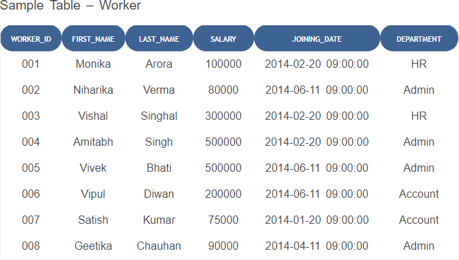

```
CREATE TABLE Worker(worker_id int,first_name varchar(10),last_name varchar(10),salary int(10),joinining_date DATETIME, department varchar(10));
INSERT INTO Worker VALUES(1,'Monika','Arora',100000,'2014-02-20 09:00:00', 'HR');
INSERT INTO Worker VALUES(2,'Niharika','Verma',80000,'2014-06-11 09:00:00', 'Admin');
INSERT INTO Worker VALUES(3,'Vishal','Singhal',300000,'2014-02-20 09:00:00', 'HR');
INSERT INTO Worker VALUES(4,'Amitabh','Singh',500000,'2014-02-20 09:00:00', 'Admin');
INSERT INTO Worker VALUES(5,'Vivek','Bhati',500000,'2014-06-11 09:00:00', 'Admin');
INSERT INTO Worker VALUES(6,'Vipul','Diwan',200000,'2014-06-11 09:00:00', 'Account');
INSERT INTO Worker VALUES(7,'Satish','Kumar',75000,'2014-01-20 09:00:00', 'Account');
INSERT INTO Worker VALUES(8,'Geetika','Chouhan',90000,'2014-04-11 09:00:00', 'Admin');
```

Sample table: Bonus

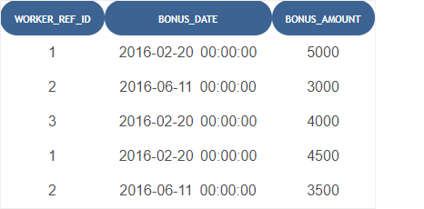

```
CREATE TABLE Bonus(worker_ref_id int,bonus_date DATETIME,bonus_amount int(10));
INSERT INTO Bonus VALUES(1,'2016-02-20 00:00:00',5000);
INSERT INTO Bonus VALUES(2,'2016-06-11 00:00:00',3000);
INSERT INTO Bonus VALUES(3,'2016-02-20 00:00:00',4000);
INSERT INTO Bonus VALUES(1,'2016-02-20 00:00:00',4500);
INSERT INTO Bonus VALUES(2,'2016-06-11 00:00:00',3500);
```

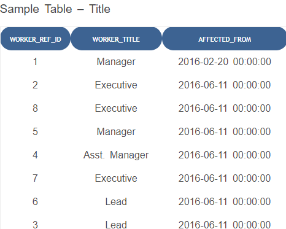

```
CREATE TABLE Title(worker_ref_id int,worker_title varchar(20),affected_from DATETIME);
INSERT INTO Title VALUES(1,'Manager','2016-02-20 00:00:00');
INSERT INTO Title VALUES(2,'Executive','2016-06-11 00:00:00');
INSERT INTO Title VALUES(8,'Executive','2016-06-11 00:00:00');
INSERT INTO Title VALUES(5,'Manager','2016-06-11 00:00:00');
INSERT INTO Title VALUES(4,'Asst. Manager','2016-06-11 00:00:00');
INSERT INTO Title VALUES(7,'Executive','2016-06-11 00:00:00');
INSERT INTO Title VALUES(6,'Lead','2016-06-11 00:00:00');
INSERT INTO Title VALUES(3,'Lead','2016-06-11 00:00:00');
```

1. **Write An SQL Query To Fetch “FIRST_NAME” From Worker Table In Upper Case alias as WORKER_FIRSTNAME.**

   ```
   SELECT first_name AS 'WORKER_FIRSTNAME' FROM Worker;
   ```
   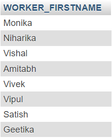
2. **Write An SQL Query To Print The First Three Characters Of FIRST_NAME From Worker Table.**

   ```
   SELECT SUBSTRING(first_name,1,3) FROM Worker;
   ```
   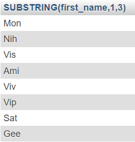
3. **Write An SQL Query To Find The Position Of The Alphabet (‘A’) In The First Name Column ‘Amitabh’ From Worker Table.**

   ```
   SELECT INSTR(first_name, 'A') AS Position_of_A FROM Worker WHERE First_Name = 'Amitabh';
   ```
   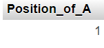
4. **Write An SQL Query To Print The FIRST_NAME And LAST_NAME From Worker Table Into A Single Column COMPLETE_NAME. A Space Char Should Separate Them.**

   ```
   SELECT CONCAT(first_name, ' ', last_name) AS COMPLETE_NAME FROM Worker;
   ```
   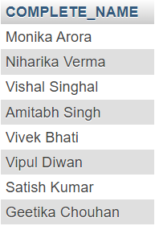
5. **Write An SQL Query To Print All Worker Details From The Worker Table Order By FIRST_NAME Ascending And DEPARTMENT Descending.**

   ```
   SELECT * FROM Worker ORDER BY first_name ASC, department DESC;
   ```
   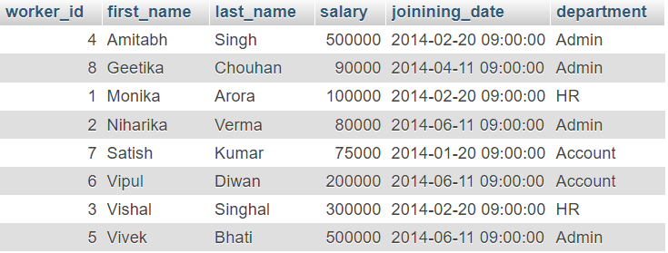
6. **Write An SQL Query To Print Details Of The Workers Whose FIRST_NAME Contains ‘A’.**

   ```
   SELECT * FROM Worker WHERE first_name LIKE '%A%';
   ```
   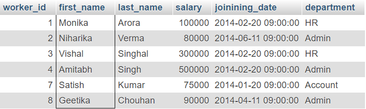
7. **Write An SQL Query To Print Details Of The Workers Whose FIRST_NAME Ends With ‘A’.**

   ```
   SELECT * FROM Worker WHERE first_name LIKE '%A';
   ```
   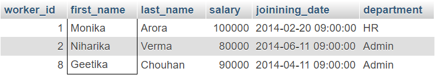
8. **Write An SQL Query To Print Details Of The Workers Whose SALARY Lies Between 100000 And 500000.**

   ```
   SELECT * FROM Worker WHERE salary BETWEEN 100000 and 500000;
   ```
   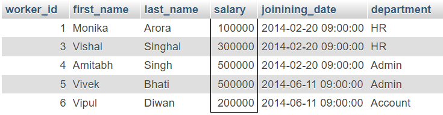
9. **Write An SQL Query To Fetch The Count Of Employees Working In The Department ‘Admin’.**

   ```
   SELECT COUNT(*) AS Admin_Count FROM Worker WHERE department = 'Admin';
   ```
   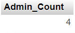
10. **Write An SQL Query To Fetch The No. Of Workers For Each Department In The Descending Order.**

    ```
    SELECT department, COUNT(*) AS worker_count FROM Worker GROUP BY department ORDER BY worker_count DESC;
    ```
    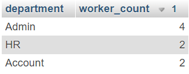
11. **Write An SQL Query To Print Details Of The Workers Who Are Also Managers.**

    ```
    SELECT w.* FROM Worker w CROSS JOIN Title t WHERE w.worker_id=t.worker_ref_id and t.worker_title='Manager';
    ```
    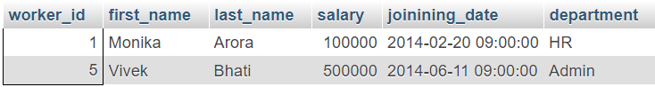
12. **Write An SQL Query To Show Only Odd Rows From A Table.**

    ```
    SELECT * FROM Worker WHERE worker_id%2!=0;
    ```
    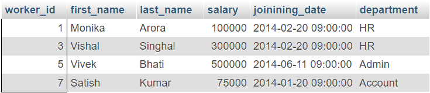
13. **Write An SQL Query To Show Records From One Table That Another Table Does Not Have.**

    ```
    SELECT w.* FROM Worker w LEFT JOIN Bonus b ON w.worker_id = b.worker_ref_id WHERE b.worker_ref_id IS NULL;
    ```
    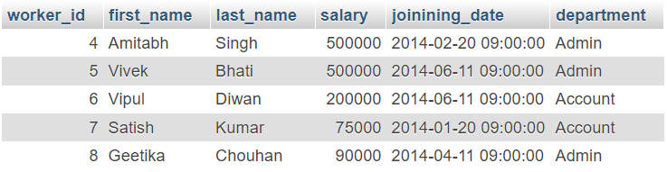
14. **Write An SQL Query To Show The Top N (Say 10) Records Of A Table.**

    ```
    SELECT * FROM Worker LIMIT 10;
    ```
    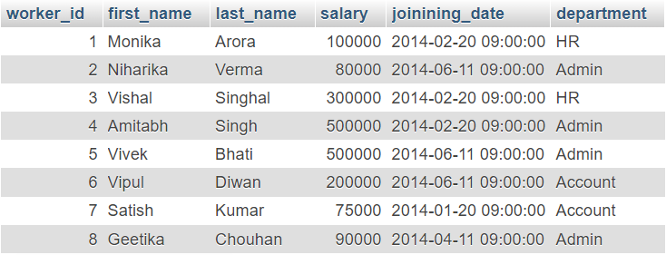
15. **Write An SQL Query To Fetch The List Of Employees With The Same Salary.**

    ```
    SELECT salary, COUNT(*) AS same_salary_emp_count FROM Worker GROUP BY salary;
    ```
    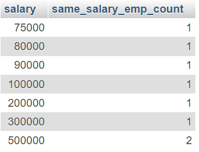
16. **Write An SQL Query To Fetch The List Of Employees With The Same Salary.**

    ```
    SELECT GROUP_CONCAT(first_name) AS emp_with_same_salary, salary FROM Worker GROUP BY salary;
    ```
    
