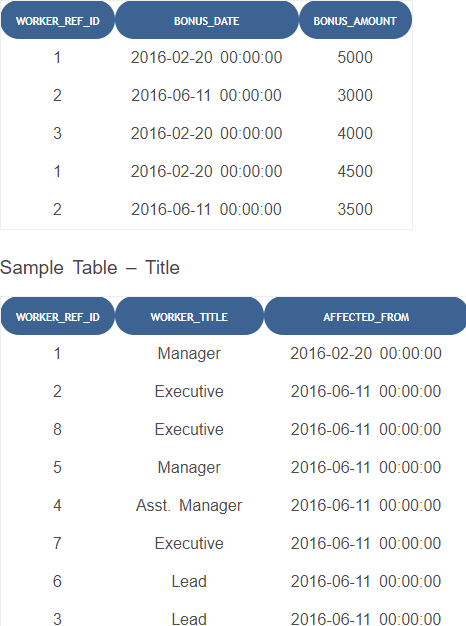

# Assignment 6

(using mysql in xampp)


```
CREATE TABLE Worker(worker_id int,first_name varchar(10),last_name varchar(10),salary int(10),joinining_date DATETIME, department varchar(10));
INSERT INTO Worker VALUES(1,'Monika','Arora','100000','2014-02-20 09:00:00', 'HR');
INSERT INTO Worker VALUES(2,'Niharika','Verma','80000','2014-06-11 09:00:00', 'Admin');
INSERT INTO Worker VALUES(3,'Vishal','Singhal','300000','2014-02-20 09:00:00', 'HR');
INSERT INTO Worker VALUES(4,'Amitabh','Singh','500000','2014-02-20 09:00:00', 'Admin');
INSERT INTO Worker VALUES(5,'Vivek','Bhati','500000','2014-06-11 09:00:00', 'Admin');
INSERT INTO Worker VALUES(6,'Vipul','Diwan','200000','2014-06-11 09:00:00', 'Account');
INSERT INTO Worker VALUES(7,'Satish','Kumar','75000','2014-01-20 09:00:00', 'Account');
INSERT INTO Worker VALUES(8,'Geetika','Chouhan','90000','2014-04-11 09:00:00', 'Admin');
```

Sample table: Bonus


